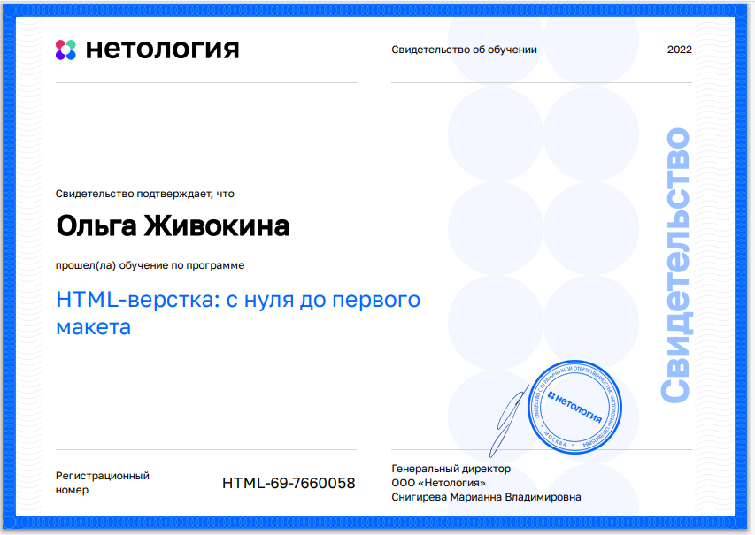
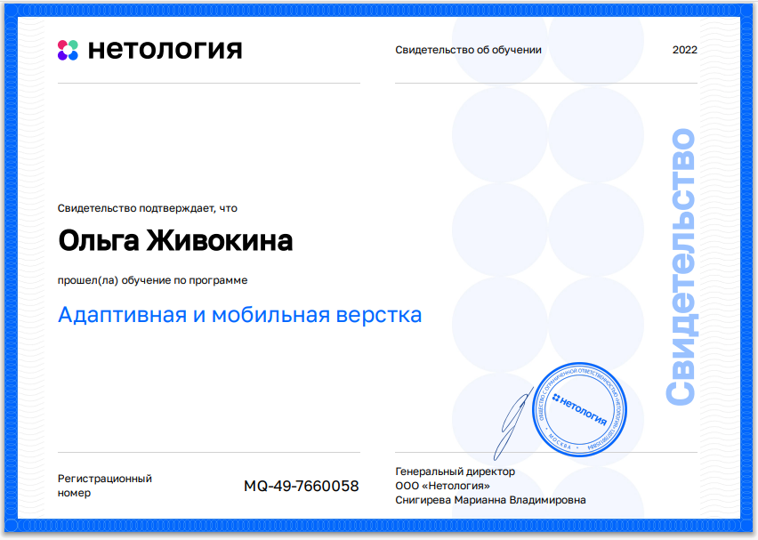
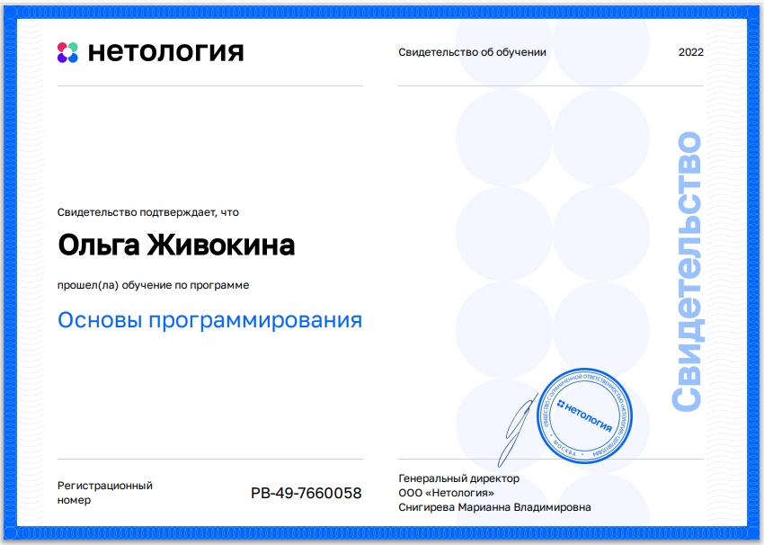
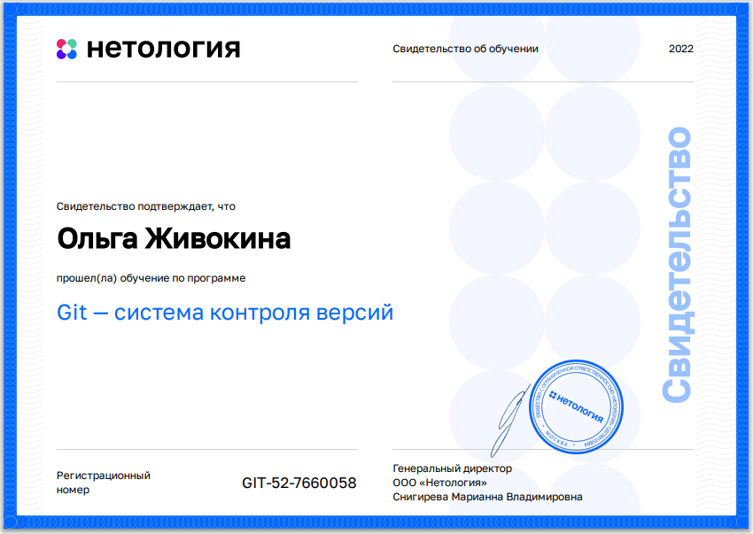

# Живокина Ольга
## Фронтенд-разработчик
## Обо мне
Добрый день!Я обучаюсь на выпускном курсе Рязанского филиала ПГУПС по специальности системное администрирование. 
В 2022-ом году начала проходить курс по повышению квалификации, получая специальность "Fullstack-разработчик на JavaScript".
Я также увлекаюсь графическим дизайном, знаю основы композиции и цветоведения. Умею отличать хороший дизайн от плохого.
## Образование и навыки
Так как я ещё не до конца завершила своё обучение, на данный момент я обладаю навыками Frontend-разработчика, а именно:
* HTML & CSS
Верстка HTML-страниц с использованием стилей CSS

* Адаптивная вёрстка
Создание "резиновых" страниц, подстаивающихся под любое устройство, а также адаптивная вёрстка, включающая
в себя несколько версий страницы под разные устройства

* Основы JavaScript
Программирование на языке JS

* GIT
Ведение проекта в гит, работа с удаленными и локальными репозиториями

С данными сертификатами в формате PDF можно также познакомиться в папке "certificates"
